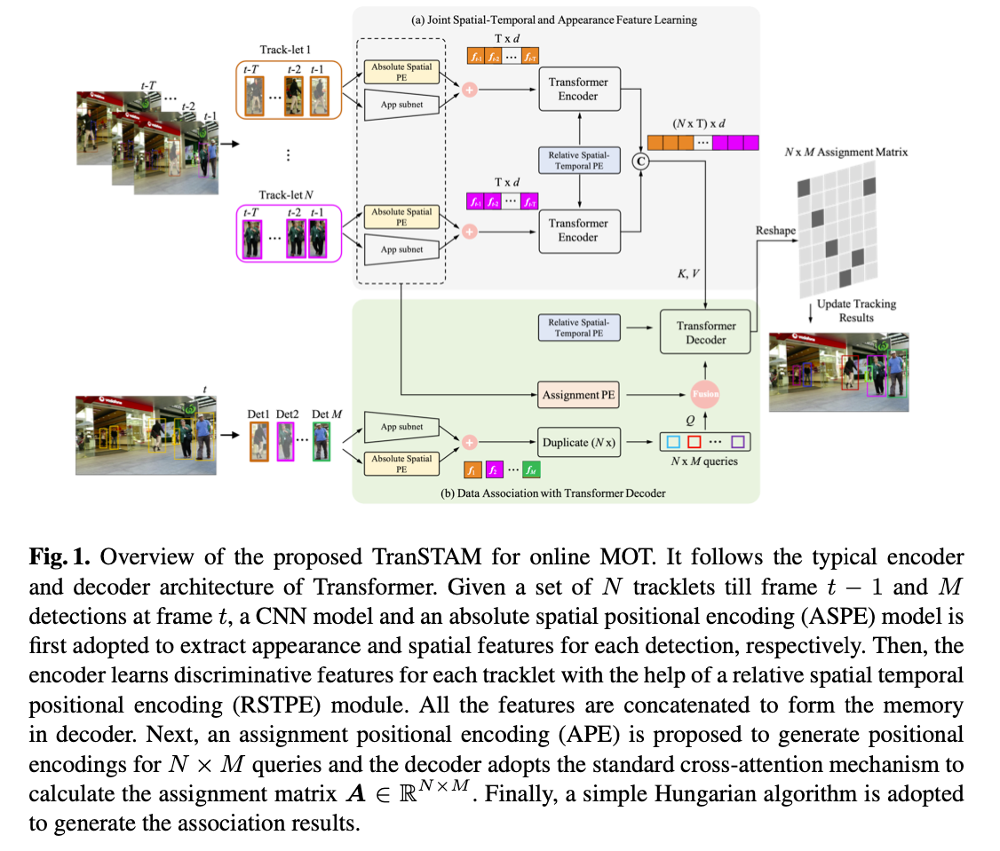

#TransSTAM

This is the code for the paper "Joint Spatial-Temporal and Appearance Modeling with Transformer for Multiple Object Tracking".



Paper: is still under review

Env: Linux only & GPU only

## Usage - On MOT17

1. Using docker we provide

```shell
docker pull icicle314/trans_stam_env:v1.0

nvidia-docker run -it -d --name TransSTAM_work_env --ipc=host -v /ssd:/ssd -v /home:/home icicle314/trans_stam_env:v1.0 bash

docker exec -it TransSTAM_work_env bash
```

2. Clone the enter this repository
```shell
cd /root
git clone git@github.com:icicle4/TransSTAM.git transstam
```

3. Download data we provide and put the data under path /root/transstam/data


4. Prepare data for train and ablation study [optional]
```shell
[optional]
# Notice: we adopt the fast-reid as our reid model. However, the authors have updated their codes. In order to get the same reid features with our trained model, we also present the codes that we used here.
# Notice: The reid extraction is time costly, you can choice directly use our provided extracted reid files.
python scripts/ReID_feature_extraction.py --config-file /root/transstam/fast-reid/configs/MOT-Strongerbaseline.yml --input_video_dir ./data/MOT_videos/MOT17_videos/ --dataset_dir ./data/prepare_detections/TMOH_17/ --output_dir ./data/
TMOH_17_pbs

[optional]
# reduce reid feature's dimension by PCA
python scripts/reduce_pb_reid_dim_by_pca.py --old_det_box_dir ./data/TMOH_17_pbs --new_det_box_dir ./data/TMOH_17_pbs_pca --old_reid_dim 2048 --new_reid_dim 256

[optional]
# generate train dataset's label by match with MOT17 gt file
python scripts/match_det_and_gt_bboxes_app_dim_generic.py --det_box_dir ./data/TMOH_17_pbs_pca/ --dataset_dir ./data/MOT17/ --iou_threshold 0.6 --output_dir ./data/TMOH_17_pbs_pca_matched_th0.6
```

5.  To train model [optional] [8 GPU need]

```shell
[optional]
# generate tracklet-detections pair hdf5 dataset for quicker dataloder
python datasets/pre_load_static_dataset.py --dataset_dir ./data/TMOH_17_pbs_pca_matched_th0.6 --hdf5_path ./data/TMOH_17_pbs_pca_matched_th0.6_imth_3.0.hdf5 --sample_window 50 --cache_window 20 --threshold 3.0

bash scripts/train.sh "TransSTAM" trans_stam 2 ./data/TMOH_17_pbs_pca_matched_th0.6_imth_3.0.hdf5
```

6. To ablation model [optional] [8 GPU need]

```shell
# build datasets for ablation study
bash scripts/build_3folder_cross_dataset.sh ./data/TMOH_17_pbs_pca_matched_th0.6

# Do ablation study
bash scripts/ablation.sh "trans_stam" ${tag} ${layer_num} ${cache_window} ${sample_window} ${aspe} ${rstpe} ${ape} ${ape_style} ${TRACKRESDIR} ${MOT17DIR} ${EVALUATIONRESDIR}

# example
bash scripts/ablation.sh "trans_stam" "baseline" 2 20 50 "with_abs_pe" "with_relative_pe" "with_assignment_pe" "diff" ${TRACKRESDIR} ${EVALUATIONRESDIR}

```
7. Inference with our trained model [1 GPU need]
```shell
bash scripts/inference_with_trained_model.sh
```